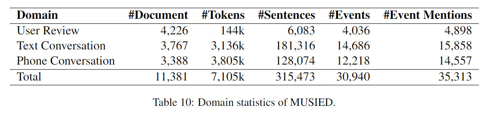

# MUSIED Dataset

`7dae4a43-MUSIED.zip` file includes `train.json`, `dev.json` and `test.json` of MUSIED dataset. The data format of the three `.json` files are the same. Each file contains a list and each item in list is a dict for a document. Take an instance in `train.json` as an example:

```JSON5
[   // A list, each item is a dict for a document
    { 
        "id": 90076777, // an unique digit string for each document
        "content": [    // the content of the document. A list, each item is a sentence. Sentence index starts with 0.
            "客服:Hi~请问您是遇到以下问题吗？,",
            "客服:您好，欢迎您进入人工客服，请输入您的问题，人工客服小美会竭诚为您服务的~,",
            "用户:餐内异物,",
            "客服:您好，我是本次为您服务的客服小美_94372，很高兴为您服务～,",
            "客服:亲亲是吃到异物了吗,",
            "用户:对,",
            "客服:十分抱歉了给您添麻烦了这边是美团外卖这边给您转接到食安专线可以嘛,",
            "用户:好的,",
            "客服:您好，我是本次为您服务的客服小美_179838，很高兴为您服务～,",
            "客服:您好，我是美团客服，很高兴为您服务。查看到您名下之前反馈过【普通异物-[鸡蛋壳][头发][肉上有毛]等】的问题，请问您是否咨询该问题的处理进展？,",
            "用户:不是,",
            "用户:是这个订单,",
            "客服:亲亲，请问订单是有什么问题呢[可怜][鲜花]，辛苦您详细描述一下呢,",
            "客服:亲亲，小美等的好辛苦[可怜]，由于您在3分钟内没有任何回应，系统已经自动结束对话了，小美不得不与您分开了呢>_<。如仍需帮助可再次发起会话，如没有其他问题，麻烦对小美的服务进行评价哦，满意请给朵鲜花，不满意请给鸡蛋，谢谢您~[亲亲]"
        ],
        "events": [ // a list for annotated events, each item is a dict for an event
            {
                "type": "异物",   //  the event type
                "trigger_word": "异物",   //  a string of the trigger word or phrase
                "sent_id": 2,   // the index of the corresponding sentence, strates with 0
                "offset": [ // the offset of the trigger words in the character list
                    5,
                    7
                ]
            },
            {
                "type": "异物",
                "trigger_word": "异物",
                "sent_id": 4,
                "offset": [
                    8,
                    10
                ]
            },
            "......"
        ],
        "domain": "Text Conversations"  // the domain type of this document.
    }
]
```

## Data Statistics

MUSIED data constains three domains: `User Review`, `Text Conversation` and `Phone Conversation`. There are 11381 documents and 35313 event mentions in MUSIED. The detail statistics are shown in the following figure:



